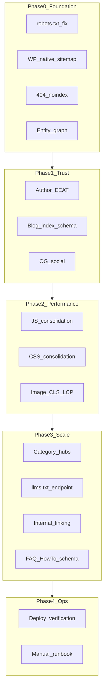
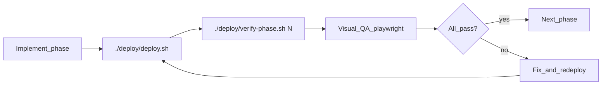

# Full Technical SEO Strategy Implementation

## Scope

**In scope:** All theme, template, asset, and deploy-script changes in [wordiva-blog-theme/](wordiva-blog-theme/).

**Out of scope (code in this repo):** `wordiva.ai` Next.js app changes — covered in [strategy/wordiva-main-site-seo.md](strategy/wordiva-main-site-seo.md).

**Documented only (ops):** GSC/GA4/Bing setup, editorial content velocity, third-party newsletter provider wiring.

**Cross-reference:** [wordiva-phase1/strategy/blog-updates.md](file:///Users/lijeesh/Documents/lijeesh/development/wordiva/wordiva-phase1/strategy/blog-updates.md) — growth-team checklist; plan below incorporates its P0/P1 items into theme phases.

Primary refactor target: [wordiva-blog-theme/inc/seo.php](wordiva-blog-theme/inc/seo.php) (390 lines today — crawl rules, meta, JSON-LD, custom sitemap all live here).

---

## Alignment with `blog-updates.md` (gaps resolved in this plan)

| `blog-updates.md` item                                               | Was in plan?                                   | Plan change                                   |
| -------------------------------------------------------------------- | ---------------------------------------------- | --------------------------------------------- |
| Specific blog index meta copy (agentic AI, WP automation, GEO)       | Partial (generic description)                  | Use exact 150–160 char copy from blog-updates |
| 404: `noindex, nofollow` + **remove** canonical                      | Partial (`noindex, follow` + wrong canonical)  | **Updated** to match blog-updates             |
| Breadcrumb `/blog/blog/` fix                                         | Yes                                            | No change                                     |
| Organization: `Wordiva.ai`, `wordiva_ai.png`, full `sameAs`          | Partial (`Wordiva`, `icon.png`, 2 social URLs) | **Updated** to canonical values below         |
| Empty article author                                                 | Yes                                            | No change                                     |
| AI crawlers incl. `OAI-SearchBot`                                    | Partial (missing OAI-SearchBot)                | **Added** OAI-SearchBot                       |
| `noindex`/Disallow `wp-json`, `xmlrpc.php`, thin author archives     | **Missing**                                    | **New** Phase 0 task                          |
| Live category slugs (`agentic-ai`, `wordiva-story`, etc.)            | Mismatch (generic bootstrap list)              | **Updated** to live taxonomy                  |
| Sticky CTA with UTM + footer Compare/Integrations/Learn links        | Partial (generic CTA)                          | **Expanded** Phase 7                          |
| RSS link in footer                                                   | Partial (head only)                            | **Added** footer RSS                          |
| WebP uploads + CloudFront cache audit                                | **Missing**                                    | **Added** Phase 3                             |
| Editorial: 2 posts/week, update 5 existing posts with internal links | N/A (editorial)                                | Referenced in ops checklist, not theme code   |
| Per-post editor checklist (slug, image, 3–5 links, FAQ)              | Partial (FAQ schema only)                      | **Added** admin UI reminders in post-meta     |



---

## Phase 0 — Crawl and Index Foundation (Strategy #1)

### 1. Replace custom sitemap with WordPress native sitemaps

- **Remove** `wordiva_generate_sitemap()` and `?sitemap=xml` handler from [inc/seo.php](wordiva-blog-theme/inc/seo.php) (lines 388–450).
- **Enable** core sitemaps explicitly in [inc/theme-setup.php](wordiva-blog-theme/inc/theme-setup.php):
  - Ensure `add_theme_support` does not disable sitemaps.
  - Add filter on `wp_sitemaps_add_provider` only if needed to include authors/categories.
- **Update** `wordiva_robots_txt()` to point to `Sitemap: https://wordiva.ai/blog/wp-sitemap.xml` (WordPress 5.5+ default path under subdirectory install).

### 2. Rewrite `wordiva_robots_txt()` in [inc/seo.php](wordiva-blog-theme/inc/seo.php)

Current aggressive rules block discovery:

```455:472:wordiva-blog-theme/inc/seo.php
        $output .= "Disallow: /feed/\n";
        ...
        $output .= "Disallow: /*?*\n";
        $output .= "Disallow: /*?\n";
```

**Changes:**

- Remove `Disallow: /*?`_ and `Disallow: /_?`.
- Remove `Disallow: /feed/` (keep RSS discoverable).
- Keep admin/plugin disallows.
- Append explicit `Allow` lines for AI crawlers: `GPTBot`, `ChatGPT-User`, `ClaudeBot`, `PerplexityBot`, `OAI-SearchBot`, `Google-Extended`, `CCBot`.
- Emit single `Sitemap:` line for `wp-sitemap.xml`.
- **Disallow low-value endpoints** (per blog-updates P0): `Disallow: /wp-json/`, `Disallow: /xmlrpc.php` (keep REST for admin; block crawler budget waste).
- Add `noindex` via meta for: search results, author archives without bio, date archives (filter in `wordiva_seo_meta_tags()`).

### 3. Fix 404 indexation in [inc/seo.php](wordiva-blog-theme/inc/seo.php)

In `wordiva_seo_meta_tags()` (per blog-updates P0):

- For `is_404()`: set `robots` to `**noindex, nofollow`\*\* (not `nofollow` on follow).
- **Omit** `<link rel="canonical">` on 404 — do not point to blog home.
- Use distinct title/description (already partially done).

### 4. Trailing-slash consistency

- Add `redirect_canonical` filter or rely on WordPress permalink settings — verify canonicals in theme always use `user_trailingslashit(get_permalink())` matching WP "Custom Structure" (live site uses **no** trailing slash).
- Add deploy verification curl for a post URL with/without slash.

### 5. Default blog description (fixes empty homepage meta)

In [inc/theme-activation.php](wordiva-blog-theme/inc/theme-activation.php), on activation:

- If `blogdescription` is empty, set blog-updates copy: _"Insights on agentic AI content marketing, WordPress blog automation, SEO, and GEO from the Wordiva team."_ (150–160 chars)
- Add matching Customizer setting in [inc/customizer.php](wordiva-blog-theme/inc/customizer.php) (`wordiva_blog_seo_description`) used as fallback in `wordiva_seo_meta_tags()` when `get_bloginfo('description')` is empty.

### 6. Main site handoff

Implement in the **wordiva.ai Next.js repo** per [strategy/wordiva-main-site-seo.md](strategy/wordiva-main-site-seo.md):

- Root `robots.txt` with blog sitemap reference
- Root `sitemap.xml` for marketing pages
- Root `llms.txt`
- Organization JSON-LD with shared `@id: https://wordiva.ai/#organization`
- `noindex` on 404 and `/dashboard`

### 7. Manual runbook (ops)

Add `strategy/manual-ops-checklist.md` with:

- Submit `https://wordiva.ai/sitemap.xml` and `https://wordiva.ai/blog/wp-sitemap.xml` in GSC.

---

## Phase 1 — Entity Graph and Schema (Strategy #2)

Refactor [inc/seo.php](wordiva-blog-theme/inc/seo.php) with shared helpers in [inc/helper-functions.php](wordiva-blog-theme/inc/helper-functions.php):

| Helper                                   | Purpose                                                                                                                                                                                                                                                                                                                                                                                                |
| ---------------------------------------- | ------------------------------------------------------------------------------------------------------------------------------------------------------------------------------------------------------------------------------------------------------------------------------------------------------------------------------------------------------------------------------------------------------ |
| `wordiva_get_organization_schema()`      | Stable `@id: https://wordiva.ai/#organization` — **canonical values from blog-updates:** name `Wordiva.ai`, url `https://wordiva.ai`, logo `https://wordiva.ai/wordiva_ai.png`, description _"Agentic AI content marketing engine for automated blogging and WordPress publishing."_, `sameAs`: LinkedIn `/company/wordiva-ai/`, Facebook `/wordivaai/`, Instagram `/wordivaai/`, Twitter `/wordivaai` |
| `wordiva_get_blog_schema()`              | `@id: {blog_url}#blog`, `isPartOf` → organization, populated description                                                                                                                                                                                                                                                                                                                               |
| `wordiva_get_blog_posting_schema($post)` | `BlogPosting` with `@id` = permalink, publisher `@id` reference                                                                                                                                                                                                                                                                                                                                        |

**Organization `sameAs` (canonical — must match main site + blog-updates):**

```json
[
  "https://www.linkedin.com/company/wordiva-ai/",
  "https://www.facebook.com/wordivaai/",
  "https://www.instagram.com/wordivaai/",
  "https://twitter.com/wordivaai"
]
```

Update [inc/customizer.php](wordiva-blog-theme/inc/customizer.php) social URL defaults and [strategy/wordiva-main-site-seo.md](strategy/wordiva-main-site-seo.md) to use these same values (currently uses `@wordiva` / `icon.png` — **drift risk**).

**Changes:**

- Replace inline Organization/WebSite/Article blocks with helpers.
- Upgrade `Article` → `BlogPosting` on singles.
- Add `WebPage` node on singles linking `mainEntity` → BlogPosting `@id`.
- Fix breadcrumb bug: when `page_for_posts` is unset, use `wordiva_get_blog_url()` instead of `home_url('/blog/')` duplicated path (source of `/blog/blog/`).
- Align visible breadcrumbs in [header.php](wordiva-blog-theme/header.php) with JSON-LD trail (add Blog step between Home and Category).
- Add `rel="home"` on logo link in [header.php](wordiva-blog-theme/header.php) (already points to main site via `wordiva_render_logo()`).
- Add `<link rel="alternate" type="application/rss+xml">` is already present; add comment in footer linking to main product site with descriptive anchor.

### Duplicate canonical fix

- Add `remove_action('wp_head', 'rel_canonical')` in [inc/seo.php](wordiva-blog-theme/inc/seo.php) since theme outputs its own canonical (live site shows duplicates).
- Verify no SEO plugin conflict on server.

---

## Phase 2 — E-E-A-T Authors (Strategy #3)

### New file: `inc/author-profile.php`

- Register user meta fields: `wordiva_job_title`, `wordiva_linkedin_url`, `wordiva_twitter_url`.
- Add fields to user profile screen in admin.
- `save_post` validation: warn/block publish if `post_author` has empty `display_name`.
- Fallback author display: "Wordiva Team" only when meta explicitly allows fallback (avoid empty strings in schema).

### Schema and templates

- Extend `wordiva_get_blog_posting_schema()` with full `Person` `@id` = `{author_url}#person`, `jobTitle`, `sameAs`, `worksFor`.
- Create [author.php](wordiva-blog-theme/author.php) (currently falls through to `archive.php`) with `ProfilePage` JSON-LD.
- Update [single.php](wordiva-blog-theme/single.php) and [template-parts/content-card.php](wordiva-blog-theme/template-parts/content-card.php) to use `wordiva_get_author_display_name()` helper; hide author row if empty.
- Remove per-card inline JSON-LD from `content-card.php` (duplicate of global schema — cards keep microdata only).

---

## Phase 3 — Core Web Vitals (Strategy #4)

### JS consolidation in [inc/enqueue-scripts.php](wordiva-blog-theme/inc/enqueue-scripts.php)

| Action           | Detail                                                                                                                                               |
| ---------------- | ---------------------------------------------------------------------------------------------------------------------------------------------------- |
| Merge            | Fold `navigation-simple.js`, `navigation-scroll.js`, `mobile-menu-fix.js` into [assets/js/navigation.js](wordiva-blog-theme/assets/js/navigation.js) |
| Remove           | Dequeue merged files; delete dead files after merge                                                                                                  |
| Inline script    | Move mobile menu logic from [header.php](wordiva-blog-theme/header.php) lines 20–60 into `navigation.js`                                             |
| Conditional load | `social-sharing.js` only on `is_singular('post')`                                                                                                    |
| Defer            | Add `defer` strategy via `wp_script_add_data(..., 'defer', true)` for non-critical scripts                                                           |

### CSS consolidation

- `@import` or merge [navigation-mobile-fix.css](wordiva-blog-theme/assets/css/navigation-mobile-fix.css) into [navigation.css](wordiva-blog-theme/assets/css/navigation.css).
- Stop enqueuing separate mobile-fix stylesheet.
- Review critical CSS inline in enqueue — remove rules duplicated in main stylesheet.

### Images

- In [template-parts/content-card.php](wordiva-blog-theme/template-parts/content-card.php) and [single.php](wordiva-blog-theme/single.php): always pass `width`/`height` to `the_post_thumbnail()`.
- Add `fetchpriority="high"` only on homepage featured/hero image.
- Add `loading="lazy"` explicitly on below-fold images (theme inline CSS already partial).

### WebP and CDN (blog-updates P2)

- Document or hook **WebP upload** via recommended plugin (ShortPixel/Smush) in theme activation admin notice — theme cannot convert server-side without plugin.
- Add deploy note to verify CloudFront cache headers on `wp-content/uploads/` (TTL, `Cache-Control`) — ops item in `manual-ops-checklist.md`.

### Deploy verification

Extend [deploy/deploy.sh](deploy/deploy.sh):

- Curl `wp-sitemap.xml`, `robots.txt`, sample post — assert 200.
- Assert robots.txt contains `OAI-SearchBot` and `Disallow: /wp-json/`.
- Optional: run `npx lighthouse` if available (non-blocking).

---

## Phase 4 — Topic Hubs and Index UX (Strategy #5)

### Category bootstrap

In [inc/theme-activation.php](wordiva-blog-theme/inc/theme-activation.php), ensure **live category slugs** exist (do not create competing duplicates):

- `agentic-ai`
- `ai-content-marketing`
- `content-marketing`
- `wordiva-story`

Add 100–200 word **default term descriptions** (fallback intro copy in `archive.php` when `category_description` empty) per blog-updates P1.

### [archive.php](wordiva-blog-theme/archive.php) enhancements

- Category hubs: H1 = category name (not "Category: X"), 150+ word intro from term description with fallback boilerplate per slug.
- Add `CollectionPage` JSON-LD in [inc/seo.php](wordiva-blog-theme/inc/seo.php) for `is_category()`.
- Visible breadcrumbs on archives (reuse new `template-parts/breadcrumbs.php`).

### [index.php](wordiva-blog-theme/index.php) category chips

- Query top-level categories with `hide_empty => false` for nav chips (Writesonic-style).
- Link each chip to `get_category_link()`.
- Surface RSS link in hero section.

---

## Phase 5 — Blog Index Schema (Strategy #6)

In `wordiva_structured_data()` when `is_home()`:

- Populate `Blog` schema `description` from customizer/default.
- Add `blogPost[]` array for latest 10 posts (headline, url, datePublished, image, author Person ref).
- Add top-level `ItemList` JSON-LD mirroring visible grid (not just microdata).
- Use hero subtitle from [index.php](wordiva-blog-theme/index.php) / customizer for homepage meta description fallback.

---

## Phase 6 — GEO and llms.txt (Strategy #7)

### Dynamic `llms.txt` endpoint in [inc/seo.php](wordiva-blog-theme/inc/seo.php)

- Register rewrite rule: `/blog/llms.txt` → query var `llms_txt=1`.
- On match, output spec-compliant Markdown:
  - H1: Wordiva
  - Blockquote summary
  - H2 sections: Product (links via `wordiva_get_main_site_url()`), Blog (latest 10 posts with excerpts), Key pages
- Auto-regenerate from published posts (no manual maintenance).

### FAQ schema helper

- New `wordiva_faq_schema_from_content($content)` — parse Gutenberg `core/details` or `core/heading`+paragraph FAQ patterns.
- Emit `FAQPage` JSON-LD on singles when ≥2 Q&A pairs detected.
- Add post meta toggle `_wordiva_enable_faq_schema` in [inc/post-meta.php](wordiva-blog-theme/inc/post-meta.php).

### Editorial guidelines + per-post checklist (`blog-updates.md` P1)

Add admin sidebar in [inc/post-meta.php](wordiva-blog-theme/inc/post-meta.php):

- Keyword in slug/H1
- 1200×630 featured image
- 3–5 internal links (blog + product)
- FAQ section + enable FAQ schema toggle
- Answer-capsule H2 structure reminder

---

## Phase 7 — Internal Linking (Strategy #8)

### New [template-parts/breadcrumbs.php](wordiva-blog-theme/template-parts/breadcrumbs.php)

- Shared breadcrumb renderer used by header (singles), `archive.php`, `author.php`.
- Trail: Home → Blog → Category (if any) → Current.

### Sticky CTA (blog-updates P1)

- New `template-parts/sticky-cta.php` on singles/archives: links to register with UTM params:
  `https://wordiva.ai/register?utm_source=blog&utm_medium=organic`
- Extend `wordiva_get_cta_url()` in [functions.php](wordiva-blog-theme/functions.php) to append UTMs when `is_blog_context`.

### Footer cross-property links (blog-updates P1)

Extend [footer.php](wordiva-blog-theme/footer.php):

- Add **Compare** → `https://wordiva.ai/compare` (Customizer override)
- Add **Integrations** → `https://wordiva.ai/integrations/wordpress`
- Add **RSS** → `https://wordiva.ai/blog/feed/` with `rel="alternate"` + visible footer link
- Keep existing Features (`#features`), Pricing (`#pricing`), Blog links

### Product deep-link block (blog-updates P1)

- New `template-parts/product-links.php` on singles — Customizer-configurable links to Next.js routes:
  - `/compare/`_, `/for/`_, `/integrations/wordpress`, `/learn/generative-engine-optimization`
- Default anchors: "Compare AI writing tools", "WordPress integration", "GEO guide"

### Post footer enhancements in [single.php](wordiva-blog-theme/single.php)

- After content, inject "Explore this topic" block linking to primary category archive.
- Add product CTA block with descriptive anchor + UTM.
- Change related posts `orderby` from `rand` to `date` for crawl consistency.

### Editorial backfill (ops — not theme code)

Update these 5 live posts with 3–5 internal links each (per blog-updates):

- `/blog/ai-content-marketing/build-ai-content-engine`
- `/blog/wordiva-story/the-hidden-cost-of-manual-content-marketing-its-more-than-you-think`
- `/blog/content-marketing/no-1-struggle-for-small-businesses-were-fixing-that`
- `/blog/content-marketing/the-vision-a-24-7-content-marketing-engine-that-never-sleeps`
- `/blog/wordiva-story/introducing-wordiva-where-words-meet-confidence`

### HTML sitemap page

- New [page-sitemap.php](wordiva-blog-theme/page-sitemap.php) page template listing all posts, categories, authors.
- Document in activation: create WP page slug `sitemap` using this template.

---

## Phase 8 — Rich Results and Social (Strategy #9)

### Assets

- Add [assets/images/wordiva-og-default.jpg](wordiva-blog-theme/assets/images/wordiva-og-default.jpg) (1200×630) — generate from brand icon + text composite.

### [inc/seo.php](wordiva-blog-theme/inc/seo.php) meta improvements

- Detect image MIME for `og:image:type` (PNG vs JPEG) via `wp_check_filetype`.
- Add `og:image:alt` from featured image alt or post title.
- Add `HowTo` schema when post meta `_wordiva_schema_type = howto` and content has ordered steps (detect `<!-- wp:list {"ordered":true} -->` or meta-defined steps).
- Add `speakable` CSS selector class `.wordiva-speakable` documented for editors; optional `SpeakableSpecification` in schema.

### Newsletter section on index

- Add customizable newsletter CTA block in [index.php](wordiva-blog-theme/index.php) + Customizer fields (`wordiva_newsletter_heading`, `wordiva_newsletter_url`) — links to external form URL (no provider SDK).

---

## Phase 9 — Measurement and Ops (Strategy #10)

### Theme-side instrumentation hooks

- Add optional Customizer fields for GA4 measurement ID; enqueue gtag in footer only when set ([footer.php](wordiva-blog-theme/footer.php)).
- Expose admin widget or Tools page showing `wordiva_failed_searches` option (already tracked in [functions.php](wordiva-blog-theme/functions.php)).

### Deploy and docs

- Extend [deploy/deploy.sh](deploy/deploy.sh) post-deploy checks (sitemap, robots, llms.txt, sample post schema).
- Create [strategy/manual-ops-checklist.md](strategy/manual-ops-checklist.md) (mirror blog-updates P1/P3):
  - GSC: submit `https://wordiva.ai/blog/wp-sitemap.xml` + `https://wordiva.ai/sitemap.xml`
  - Bing Webmaster Tools
  - Monthly Screaming Frog crawl of `/blog/`
  - Monthly CWV review
  - Content velocity: 2 posts/week across agentic AI, WP automation, GEO/AEO, B2B SaaS, Wordiva story
  - Per-post editorial checklist: keyword in slug/H1, 1200×630 image, 3–5 internal links, FAQ block
  - Backfill internal links on 5 existing posts (URLs listed in Phase 7)
  - AI citation prompt list (20 queries from strategy doc)

---

## File Change Summary

| File                                   | Changes                                                                                     |
| -------------------------------------- | ------------------------------------------------------------------------------------------- |
| `inc/seo.php`                          | Major refactor: robots, meta, schema graph, llms.txt, FAQ/HowTo, 404, remove custom sitemap |
| `inc/helper-functions.php`             | Schema helpers, author helpers, breadcrumb data                                             |
| `inc/author-profile.php`               | **New** — user meta, publish validation                                                     |
| `inc/theme-activation.php`             | Default tagline, categories, sitemap page                                                   |
| `inc/customizer.php`                   | SEO description, newsletter, GA4 ID                                                         |
| `inc/enqueue-scripts.php`              | JS/CSS consolidation, conditional loads                                                     |
| `inc/post-meta.php`                    | FAQ/HowTo schema toggles                                                                    |
| `inc/theme-setup.php`                  | Image attrs support, disable duplicate canonical                                            |
| `header.php`                           | Use breadcrumb partial, remove inline JS                                                    |
| `footer.php`                           | GA4 hook, product link                                                                      |
| `index.php`                            | Category chips, newsletter, RSS                                                             |
| `archive.php`                          | Hub layout, breadcrumbs, CollectionPage                                                     |
| `single.php`                           | Topic links, product CTA, speakable class                                                   |
| `author.php`                           | **New** — ProfilePage template                                                              |
| `page-sitemap.php`                     | **New** — HTML sitemap template                                                             |
| `template-parts/breadcrumbs.php`       | **New**                                                                                     |
| `template-parts/content-card.php`      | Author fix, remove duplicate JSON-LD                                                        |
| `assets/js/navigation.js`              | Absorb other nav scripts                                                                    |
| `assets/css/navigation.css`            | Absorb mobile-fix rules                                                                     |
| `assets/images/wordiva-og-default.jpg` | **New**                                                                                     |
| `deploy/deploy.sh`                     | Optional `--verify <phase>`; post-deploy smoke                                              |
| `deploy/verify-phase.sh`               | **New** — per-phase automated assertions against production                                 |
| `deploy/visual-checklist.md`           | **New** — viewport/page visual QA checklist                                                 |
| `strategy/manual-ops-checklist.md`     | **New** — out-of-repo ops tasks                                                             |
| `strategy/wordiva-main-site-seo.md`    | **Update pending** — align Organization logo/`sameAs` with blog-updates canonical values    |
| `strategy/blog-updates-sync.md`        | **New** — pointer/summary linking to phase-1 checklist (optional, for repo discoverability) |

**Delete after merge:** `navigation-simple.js`, `navigation-scroll.js`, `mobile-menu-fix.js`, `navigation-mobile-fix.css` (if fully merged).

---

## Post-Phase Testing Protocol

**Rule:** No phase is complete until deploy + automated checks + visual QA pass on production. If anything fails, fix in the **same phase** and redeploy before starting the next phase.

### Standard gate workflow (every phase)



**1. Deploy**

```bash
cd /Users/lijeesh/Documents/lijeesh/development/wordiva/blog_theme
./deploy/deploy.sh
```

Confirm output: `Site check passed (HTTP 200)` and theme branding detected.

**2. Automated checks** — new script [deploy/verify-phase.sh](deploy/verify-phase.sh):

- Args: `./deploy/verify-phase.sh <phase_number>` (0–9) or `all`
- Uses `curl` + `grep` against `https://wordiva.ai/blog` (extend [deploy/deploy.sh](deploy/deploy.sh) `verify_site()` to call this optionally via `./deploy/deploy.sh --verify 0`)
- Exit non-zero on failure; print which assertion failed

**3. Visual QA** — browser pass on live site (Playwright MCP or manual):

| Viewport | Width | Pages |
| -------- | ----- | ----- |
| Mobile | 375×812 | All URLs below |
| Desktop | 1280×800 | All URLs below |

**URLs to open every phase** (baseline smoke):

- `https://wordiva.ai/blog/`
- `https://wordiva.ai/blog/ai-content-marketing/build-ai-content-engine`
- `https://wordiva.ai/blog/category/ai-content-marketing`
- `https://wordiva.ai/blog/author/rubia` (after Phase 2)
- `https://wordiva.ai/blog/this-url-does-not-exist` (404)
- `https://wordiva.ai/blog/?s=test` (search)

**Visual checklist** (flag and fix before sign-off):

- Header/logo alignment; no overlap with nav
- Mobile hamburger opens/closes; menu fully visible; no body scroll lock bugs
- Breadcrumbs readable; no truncation overflow on mobile
- Hero / featured card image not broken; correct aspect ratio
- Post grid cards aligned; no staggered heights causing layout jump
- Single post: title, author avatar, featured image, content width, share buttons
- Footer links wrap correctly; social icons visible; no clipped text
- Sticky CTA (Phase 7+): does not cover content or cookie banners; dismissible if designed
- No horizontal scrollbar on any page
- No console JS errors (`browser_console_messages` — red errors = fail)
- Typography: headings hierarchy visible; links distinguishable; focus rings on tab

**4. Screenshot evidence** (optional but recommended)

- Save screenshots to `deploy/screenshots/phase-N-{mobile,desktop}-{page}.png` after each gate for before/after comparison.

**5. Fix loop**

- Technical failure → fix theme code → redeploy → re-run `verify-phase.sh`
- Visual failure → fix CSS/JS/template → redeploy → re-check affected URLs only
- Do **not** proceed to next phase with known visual regressions

---

### Phase 0 gate — Crawl and index foundation

**Deploy:** `./deploy/deploy.sh`

**Automated (`verify-phase.sh 0`):**

| Check | Command / assertion |
| ----- | ------------------- |
| Blog home 200 | `curl -sI -L https://wordiva.ai/blog/ \| head -1` |
| Meta description populated | `curl -sL .../blog/ \| grep 'meta name="description"'` not empty |
| robots.txt 200 + plain text | not HTML 404 page |
| No `/*?*` disallow | robots body must not contain `Disallow: /*?` |
| `OAI-SearchBot` present | robots contains `OAI-SearchBot` |
| `Disallow: /wp-json/` | robots contains wp-json disallow |
| wp-sitemap.xml 200 | `curl -sI .../blog/wp-sitemap.xml` |
| Old sitemap gone | `?sitemap=xml` returns 404 or redirects to wp-sitemap |
| 404 noindex | fake URL has `noindex, nofollow`; no `<link rel="canonical" href=".../blog/">` |
| Search noindex | `?s=test` has `noindex` in robots meta |

**Visual:** Blog index loads; hero title visible; post cards render; no white flash or broken layout after deploy.

---

### Phase 1 gate — Entity and schema graph

**Automated (`verify-phase.sh 1`):**

| Check | Assertion |
| ----- | --------- |
| Organization name | JSON-LD contains `"Wordiva.ai"` |
| Logo URL | JSON-LD contains `wordiva_ai.png` |
| sameAs count | Four social URLs from blog-updates |
| No `/blog/blog/` | BreadcrumbList JSON-LD must not contain `blog/blog` |
| BlogPosting type | Single post JSON-LD `@type":"BlogPosting"` |
| Single canonical | Exactly one `<link rel="canonical">` on post |
| Publisher @id | `"@id":"https://wordiva.ai/#organization"` |

**Visual:** Breadcrumbs on single post show Home → category → title; no duplicate breadcrumb bars; JSON-LD changes did not break `wp_head` layout.

**External:** [Google Rich Results Test](https://search.google.com/test/rich-results) on one post URL — 0 errors.

---

### Phase 2 gate — Authors (E-E-A-T)

**Automated (`verify-phase.sh 2`):**

| Check | Assertion |
| ----- | --------- |
| Author in schema | `"author":{"@type":"Person","name":` not empty on sample post |
| Author archive 200 | `/blog/author/rubia` returns 200 |
| ProfilePage schema | author page has ProfilePage or Person JSON-LD |

**Visual:**

- Author byline visible on post cards and single post
- Avatar renders (not broken image icon)
- Author bio section on single post when bio filled
- Author archive page: avatar, name, post list grid intact

---

### Phase 3 gate — Performance (CWV)

**Automated (`verify-phase.sh 3`):**

| Check | Assertion |
| ----- | --------- |
| Script count reduced | Fewer `<script src=` tags vs pre-phase baseline (record count) |
| social-sharing absent on index | homepage HTML should not load social-sharing.js |
| No 404 JS/CSS | all enqueued asset URLs return 200 |

**Visual:**

- Mobile menu still works after JS merge (critical regression risk)
- Navigation scroll behavior intact
- No FOUC or flash of unstyled mobile menu
- Images on index/single not stretched or pixelated

**Performance:** Lighthouse mobile on single post — Performance ≥ 85; note LCP/CLS/INP in phase sign-off comment.

---

### Phase 4 gate — Topic hubs and category UX

**Automated (`verify-phase.sh 4`):**

| Check | Assertion |
| ----- | --------- |
| Category archives 200 | `/blog/category/agentic-ai`, `ai-content-marketing`, `content-marketing`, `wordiva-story` |
| CollectionPage schema | category page JSON-LD contains `CollectionPage` |
| Category chips on index | homepage contains links to category archives |

**Visual:**

- Category chips row wraps on mobile; active/hover states correct
- Archive H1 = category name (not "Category: X")
- Intro paragraph visible (100–200 words); readable line length
- Post grid on archive matches index card style

---

### Phase 5 gate — Blog index schema

**Automated (`verify-phase.sh 5`):**

| Check | Assertion |
| ----- | --------- |
| Blog schema description | JSON-LD Blog node has non-empty `description` |
| blogPost array | homepage JSON-LD contains `blogPost` with ≥1 entry |
| ItemList | homepage JSON-LD contains `ItemList` |
| OG description | `og:description` not empty on `/blog/` |

**Visual:** Homepage hero subtitle and meta-aligned copy visible; featured post section unchanged visually.

---

### Phase 6 gate — GEO and llms.txt

**Automated (`verify-phase.sh 6`):**

| Check | Assertion |
| ----- | --------- |
| llms.txt 200 | `curl -sL .../blog/llms.txt` starts with `# Wordiva` |
| Valid markdown structure | H1, blockquote or H2 sections present |
| FAQ schema on FAQ post | test post with FAQ block emits `FAQPage` when enabled |

**Visual:** No layout change on posts from FAQ schema injection (JSON-LD only in head).

---

### Phase 7 gate — Internal linking and CTAs

**Automated (`verify-phase.sh 7`):**

| Check | Assertion |
| ----- | --------- |
| Sticky CTA URL | contains `utm_source=blog&utm_medium=organic` |
| Footer Compare link | `href` contains `/compare` |
| Footer Integrations | `href` contains `/integrations/wordpress` |
| Footer RSS | `href` contains `/blog/feed` |
| Product links block | single post HTML contains learn/integrations/compare links |

**Visual (high regression risk):**

- Sticky CTA position: bottom-right or designed slot; no overlap with footer or mobile nav
- Product links block spacing consistent with related posts
- Breadcrumbs on archive pages match singles
- HTML sitemap page (`/blog/sitemap/`) readable linked list
- All new footer links clickable; open correct destinations

---

### Phase 8 gate — Rich results and social

**Automated (`verify-phase.sh 8`):**

| Check | Assertion |
| ----- | --------- |
| OG default image 200 | page without featured image returns 200 for og:image URL |
| og:image:type correct | PNG posts use `image/png` not `image/jpeg` |
| og:image:alt present | single post has `og:image:alt` |
| Newsletter block | index contains newsletter section when enabled |

**Visual:**

- Newsletter CTA section on index: form/button aligned, not broken on mobile
- Share buttons still styled correctly
- Default OG image not referenced as broken img on cards without thumbnails

**External:** [Facebook Sharing Debugger](https://developers.facebook.com/tools/debug/) on one post — image previews correctly.

---

### Phase 9 gate — Measurement and ops (final)

**Automated (`verify-phase.sh 9` or `all`):**

- Run phases 0–8 assertions in one pass
- GA4 script present in HTML only when Customizer ID set
- Failed searches admin page loads in WP admin (manual)

**Visual:** Final full-site pass — all URLs in baseline list at mobile + desktop.

**Deliverables:**

- `strategy/manual-ops-checklist.md` complete
- Screenshot folder `deploy/screenshots/phase-final/` archived
- Sign-off comment in PR/commit listing any visual fixes made per phase

---

### New deploy/testing files (implementation)

| File | Purpose |
| ---- | ------- |
| [deploy/verify-phase.sh](deploy/verify-phase.sh) | Phase-scoped curl/grep assertions; exit 1 on fail |
| [deploy/visual-checklist.md](deploy/visual-checklist.md) | Printable visual QA steps per viewport |
| [deploy/deploy.sh](deploy/deploy.sh) | Add optional `--verify <phase>` flag post-deploy |
| `deploy/screenshots/` | gitignored; store phase gate screenshots |

---

## Verification Checklist (final release — all phases)

1. Rich Results Test on homepage, single post, category archive — 0 errors.
2. `curl https://wordiva.ai/blog/robots.txt` — sitemap line, no `/*?`\* block.
3. `curl https://wordiva.ai/blog/wp-sitemap.xml` — includes all posts.
4. `curl https://wordiva.ai/blog/llms.txt` — valid Markdown.
5. 404 URL returns `noindex, nofollow` and no canonical tag.
6. `robots.txt` includes `OAI-SearchBot` and `Disallow: /wp-json/`.
7. Organization JSON-LD matches blog-updates: `Wordiva.ai`, `wordiva_ai.png`, four `sameAs` URLs.
8. Article schema shows non-empty author (e.g. Rubia) and `Wordiva.ai` publisher `@id`.
9. Lighthouse mobile on single post — target Performance ≥ 85 (≥ 90 stretch).
10. No duplicate `<link rel="canonical">` in post HTML source.
11. Footer includes Compare, Integrations, and RSS feed link.
12. Sticky CTA includes `utm_source=blog&utm_medium=organic`.

---

## Estimated Effort

| Phase                                | Dev days | Test gate |
| ------------------------------------ | -------- | --------- |
| Phase 0–1 (crawl + entity + authors) | 3–4      | +0.5 day  |
| Phase 2 (performance)                | 2        | +0.5 day  |
| Phase 3–5 (hubs, schema, GEO)        | 3–4      | +1 day    |
| Phase 6–7 (linking, rich results)    | 2–3      | +0.5 day  |
| Phase 8 (measurement + deploy)       | 1        | +0.5 day  |
| Testing infra (`verify-phase.sh`)    | —        | 0.5 day   |
| **Total**                            | **13–17 days** | |

Implement in order above. **Each phase ends with:** `./deploy/deploy.sh` → `./deploy/verify-phase.sh N` → visual QA on live site → fix regressions → then proceed to next phase.
