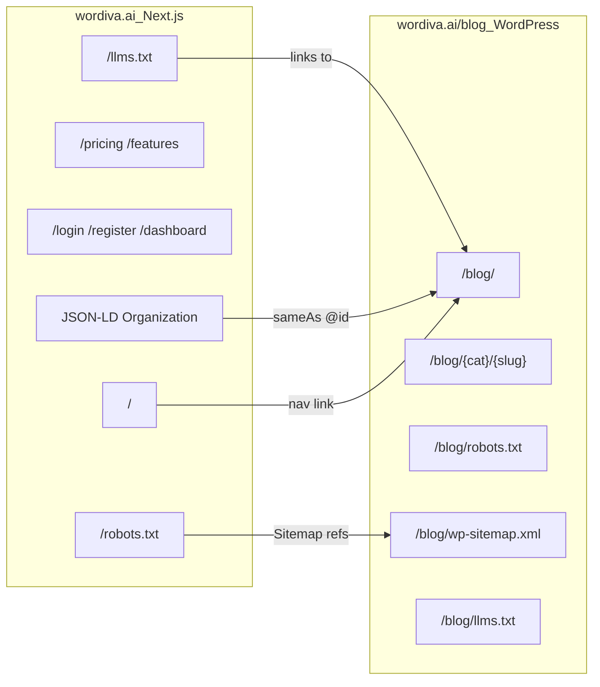

# Wordiva.ai Main Site — SEO Implementation Guide

**Repo:** `wordiva.ai` (Next.js application)  
**Companion:** [technical-seo-strategy.md](./technical-seo-strategy.md) · [blog theme implementation plan](../.cursor/plans/full_seo_strategy_implementation_02d108cf.plan.md)  
**Blog property:** `https://wordiva.ai/blog` (WordPress — separate `blog_theme` repo)  
**Prepared:** June 11, 2026

---

## Purpose

This document lists SEO work that **must be done in the `wordiva.ai` Next.js repo**, not in the WordPress blog theme. The blog theme handles `/blog/*`; the main site handles `/`, `/login`, `/register`, `/dashboard`, and product marketing pages.

**Current gap (live audit):** `https://wordiva.ai/robots.txt` returns a **404 HTML page** with `noindex`. Crawlers have no root-level discovery signal for the product site or cross-link to the blog sitemap.

---

## Architecture



**Entity rule:** Both properties must share one Organization entity (`@id: https://wordiva.ai/#organization`). The blog theme will emit this after its Phase 1 refactor; the main site must emit the **same** `@id` and `sameAs` values.

---

## Priority 1 — Root `robots.txt`

### Problem

No valid `robots.txt` at domain root. Crawlers and AI bots cannot discover sitemaps or understand crawl policy for the marketing site.

### Implementation (Next.js App Router)

**Option A — Static file (simplest)**

Create `public/robots.txt`:

```txt
# https://wordiva.ai/robots.txt
User-agent: *
Allow: /

# App routes — no SEO value; reduce crawl noise
Disallow: /dashboard
Disallow: /api/

# AI crawlers — allow marketing + blog content
User-agent: GPTBot
Allow: /
Allow: /blog/

User-agent: ChatGPT-User
Allow: /
Allow: /blog/

User-agent: ClaudeBot
Allow: /
Allow: /blog/

User-agent: PerplexityBot
Allow: /
Allow: /blog/

User-agent: Google-Extended
Allow: /
Allow: /blog/

User-agent: CCBot
Allow: /
Allow: /blog/

# Sitemaps
Sitemap: https://wordiva.ai/sitemap.xml
Sitemap: https://wordiva.ai/blog/wp-sitemap.xml
```

**Option B — Dynamic route (if env-specific rules needed)**

Create `app/robots.ts` (or `app/robots.txt/route.ts`):

```typescript
import type { MetadataRoute } from 'next';

export default function robots(): MetadataRoute.Robots {
  return {
    rules: [
      {
        userAgent: '*',
        allow: '/',
        disallow: ['/dashboard', '/api/'],
      },
      {
        userAgent: ['GPTBot', 'ChatGPT-User', 'ClaudeBot', 'PerplexityBot', 'Google-Extended', 'CCBot'],
        allow: ['/', '/blog/'],
      },
    ],
    sitemap: [
      'https://wordiva.ai/sitemap.xml',
      'https://wordiva.ai/blog/wp-sitemap.xml',
    ],
  };
}
```

### Verification

```bash
curl -sI https://wordiva.ai/robots.txt | head -5
curl -s https://wordiva.ai/robots.txt | grep -i sitemap
```

Expected: `HTTP 200`, `Content-Type: text/plain`, two `Sitemap:` lines.

---

## Priority 2 — Main Site XML Sitemap

### Problem

Product pages (home, pricing, features, about) are not in the blog WordPress sitemap. Root sitemap must list marketing URLs.

### Implementation

**Option A — `app/sitemap.ts` (App Router)**

```typescript
import type { MetadataRoute } from 'next';

const BASE = 'https://wordiva.ai';

export default function sitemap(): MetadataRoute.Sitemap {
  const lastModified = new Date();
  return [
    { url: BASE, lastModified, changeFrequency: 'weekly', priority: 1 },
    { url: `${BASE}/blog`, lastModified, changeFrequency: 'daily', priority: 0.9 },
    // Add routes as they ship:
    // { url: `${BASE}/pricing`, lastModified, changeFrequency: 'monthly', priority: 0.8 },
    // { url: `${BASE}/about`, lastModified, changeFrequency: 'monthly', priority: 0.6 },
  ];
}
```

**Option B — Extend sitemap dynamically** from a `routes.ts` config or CMS if marketing pages grow.

### Notes

- Do **not** duplicate blog post URLs here if `wp-sitemap.xml` already covers them — reference the WP sitemap in `robots.txt` instead.
- Include only canonical marketing URLs (no query strings, no `/dashboard`).

### Verification

```bash
curl -s https://wordiva.ai/sitemap.xml | head -30
```

---

## Priority 3 — Root `llms.txt`

### Problem

AI systems lack a curated index of Wordiva product pages. Competitors (Writesonic, Frase) publish `llms.txt` for GEO discovery.

### Implementation

Create `public/llms.txt` (static) or `app/llms.txt/route.ts` (dynamic):

```markdown
# Wordiva

> Wordiva is a 24/7 agentic AI content marketing engine. It automates brand intelligence, strategy, ideation, drafting, SEO, image generation, and WordPress publishing for B2B teams.

## Product

- [Home](https://wordiva.ai/): Agentic AI content marketing platform overview
- [Register](https://wordiva.ai/register): Create a Wordiva account
- [Login](https://wordiva.ai/login): Sign in to your workspace

## Blog

- [Wordiva Blog](https://wordiva.ai/blog/): AI content marketing, B2B growth, and GEO insights

For the full list of articles, see [blog llms.txt](https://wordiva.ai/blog/llms.txt) (auto-generated by WordPress theme).

## Optional

- [Dashboard](https://wordiva.ai/dashboard): Authenticated app (not for indexing)
```

**Maintenance:** Update Product links when new marketing pages ship. Blog section can point to `/blog/llms.txt` for auto-updated post lists (implemented in blog theme Phase 6).

### Verification

```bash
curl -s https://wordiva.ai/llms.txt | head -20
```

---

## Priority 4 — Organization JSON-LD (Entity Graph)

### Problem

Blog and product site must share one Organization entity. Live blog schema currently says "Wordiva Blog" — main site should be the **canonical** Organization source.

### Implementation

Add to root layout `app/layout.tsx` (or a shared `<SiteJsonLd />` component):

```tsx
const organizationJsonLd = {
  '@context': 'https://schema.org',
  '@type': 'Organization',
  '@id': 'https://wordiva.ai/#organization',
  name: 'Wordiva',
  url: 'https://wordiva.ai',
  logo: {
    '@type': 'ImageObject',
    url: 'https://wordiva.ai/icon.png',
    width: 632,
    height: 545,
  },
  description:
    'Agentic AI content marketing engine that automates strategy, drafting, SEO, and publishing.',
  sameAs: [
    'https://twitter.com/wordiva',
    'https://linkedin.com/company/wordiva',
  ],
  knowsAbout: [
    'AI content marketing',
    'content automation',
    'SEO',
    'generative engine optimization',
  ],
};

// In layout <head>:
<script
  type="application/ld+json"
  dangerouslySetInnerHTML={{ __html: JSON.stringify(organizationJsonLd) }}
/>
```

Also add `WebSite` schema with `publisher: { '@id': 'https://wordiva.ai/#organization' }` and optional `SearchAction` if site search exists.

### Cross-property alignment

| Field | Main site (`wordiva.ai`) | Blog (`/blog`) |
|-------|--------------------------|----------------|
| Organization `@id` | `https://wordiva.ai/#organization` | Same `@id` via reference |
| Organization `name` | `Wordiva` | Publisher references `@id`, not "Wordiva Blog" |
| Blog `@id` | — | `https://wordiva.ai/blog/#blog` with `isPartOf` → org |

---

## Priority 5 — Page Metadata (Next.js `metadata` API)

### Problem

Main site pages need consistent titles, descriptions, and OG tags. Marketing pages are the primary conversion surface.

### Implementation

Per-route `metadata` export or shared helper:

```typescript
// lib/seo.ts
export const siteConfig = {
  name: 'Wordiva',
  title: 'Wordiva — Your 24/7 Agentic AI Content Marketing Engine',
  description:
    'Automate your entire blog content lifecycle—brand intelligence, strategy, ideation, drafting, high-fidelity AI images, SEO, and auto-publishing to WordPress.',
  url: 'https://wordiva.ai',
  ogImage: 'https://wordiva.ai/og-image.png', // create 1200x630 asset
  twitter: '@wordiva',
};

// app/layout.tsx
export const metadata: Metadata = {
  metadataBase: new URL(siteConfig.url),
  title: { default: siteConfig.title, template: '%s | Wordiva' },
  description: siteConfig.description,
  openGraph: {
    type: 'website',
    locale: 'en_US',
    url: siteConfig.url,
    siteName: 'Wordiva',
    images: [{ url: siteConfig.ogImage, width: 1200, height: 630, alt: 'Wordiva' }],
  },
  twitter: {
    card: 'summary_large_image',
    site: siteConfig.twitter,
    creator: siteConfig.twitter,
  },
  alternates: {
    types: {
      'application/rss+xml': 'https://wordiva.ai/blog/feed',
    },
  },
};
```

### Create OG image asset

- Add `public/og-image.png` (1200×630) — brand icon + tagline.
- Reuse across home, pricing, and feature pages.

---

## Priority 6 — 404 and App Route Indexation

### Problem

Live audit: `wordiva.ai/robots.txt` served the **404 page** with `<meta name="robots" content="noindex">`. App routes like `/dashboard` should not compete for SEO.

### Implementation

**`app/not-found.tsx`**

```typescript
export const metadata = {
  title: 'Page Not Found',
  robots: { index: false, follow: true },
};
```

**Authenticated / utility routes** — add to each layout or via route group:

```typescript
// app/(app)/dashboard/layout.tsx
export const metadata = {
  robots: { index: false, follow: false },
};
```

Apply `noindex` to: `/dashboard`, `/api/*`, auth callback routes, internal tools.

**Do not** serve HTML 404 for static assets like `/robots.txt` — ensure static files or `robots.ts` take precedence.

---

## Priority 7 — Performance (Core Web Vitals)

### Problem

Main site is client-heavy (React, animations, blur effects). CWV affects whole-domain perception including `/blog`.

### Implementation checklist

| Item | Action |
|------|--------|
| LCP | Preload hero image / logo; avoid render-blocking CSS |
| INP | Defer non-critical JS; audit Framer Motion / heavy listeners on landing |
| CLS | Explicit `width`/`height` on images; reserve space for dynamic content |
| Fonts | `next/font` with `display: 'swap'`; subset weights |
| Third-party | Lazy-load analytics; use `next/script` strategy `afterInteractive` |
| Images | `next/image` everywhere; WebP/AVIF via Next optimizer |

### Verification

```bash
npx lighthouse https://wordiva.ai --only-categories=performance,seo --view
```

Target: Performance ≥ 85 mobile, SEO ≥ 95.

---

## Priority 8 — Internal Linking (Product ↔ Blog)

### Implementation

| Location | Link |
|----------|------|
| Main nav | `Blog` → `https://wordiva.ai/blog` |
| Footer | `Blog`, `Resources` section with latest 3 posts (optional ISR fetch from WP REST API) |
| Homepage | "Latest from the blog" section with post cards |
| Blog header | Already links to `wordiva.ai` via theme |

**Optional ISR blog teaser** (main site):

```typescript
// Fetch from WordPress REST API
const res = await fetch('https://wordiva.ai/blog/wp-json/wp/v2/posts?per_page=3&_embed', {
  next: { revalidate: 3600 },
});
```

---

## Priority 9 — Analytics and Search Console

### Google Search Console

1. Verify **domain property** `wordiva.ai` (DNS TXT) — covers both `/` and `/blog/`.
2. Submit sitemaps:
   - `https://wordiva.ai/sitemap.xml`
   - `https://wordiva.ai/blog/wp-sitemap.xml`
3. Monitor: Page indexing, CWV, manual actions.

### GA4

- Single property for `wordiva.ai` with referral exclusions for own subpaths.
- Event: `blog_cta_click`, `register_click` from blog → product.

### Bing Webmaster Tools

- Verify domain; submit same sitemaps (ChatGPT citation pipeline).

---

## Priority 10 — Cloudflare / CDN (if applicable)

If Cloudflare sits in front of both properties:

- Ensure **AI crawlers are not blocked** by Bot Fight Mode or WAF rules.
- Allowlist: `GPTBot`, `ClaudeBot`, `PerplexityBot`, `Googlebot`.
- Cache static `robots.txt`, `llms.txt`, `sitemap.xml` with reasonable TTL.
- Do not cache authenticated `/dashboard` responses.

---

## File Checklist (Next.js repo)

| File / route | Purpose |
|--------------|---------|
| `public/robots.txt` or `app/robots.ts` | Crawl policy + sitemap discovery |
| `app/sitemap.ts` | Marketing URL sitemap |
| `public/llms.txt` or `app/llms.txt/route.ts` | AI discovery index |
| `public/og-image.png` | Default social preview (1200×630) |
| `lib/seo.ts` | Shared metadata config |
| `app/layout.tsx` | Organization + WebSite JSON-LD |
| `components/SiteJsonLd.tsx` | Reusable structured data |
| `app/not-found.tsx` | `noindex` on 404 |
| `app/(app)/dashboard/layout.tsx` | `noindex` on app routes |
| Homepage / footer components | Blog links, optional WP REST teaser |

---

## Deployment Verification Script

Add to CI or run post-deploy:

```bash
#!/usr/bin/env bash
set -euo pipefail
BASE="https://wordiva.ai"

check() {
  local path="$1"
  local expect="$2"
  local body
  body="$(curl -sSL "${BASE}${path}")"
  echo "$body" | grep -qi "$expect" || { echo "FAIL: ${path} missing '${expect}'"; exit 1; }
  echo "OK: ${path}"
}

check "/robots.txt" "Sitemap:"
check "/robots.txt" "wp-sitemap.xml"
check "/sitemap.xml" "wordiva.ai"
check "/llms.txt" "Wordiva"
curl -sSI "${BASE}/" | grep -qi "200 OK" && echo "OK: /"
curl -sSI "${BASE}/robots.txt" | grep -qi "text/plain" && echo "OK: robots content-type"
```

---

## Coordination with Blog Theme Repo

| Task | Owner repo | Dependency |
|------|------------|------------|
| Organization `@id` graph | Both | Main site should deploy first or simultaneously |
| `wp-sitemap.xml` URL in root robots | Main site | After blog theme enables WP native sitemap |
| `/blog/llms.txt` auto-generated | Blog theme | Main `llms.txt` links to it |
| Author / BlogPosting schema | Blog theme | Main site only needs Organization |
| Category hubs, FAQ schema | Blog theme | No main site change |
| Root `robots.txt` | **Main site** | Blocks discovery until shipped |

**Recommended order:**

1. Main site: `robots.txt` + `sitemap.xml` + `llms.txt` (this doc)
2. Blog theme: Phase 0–1 (crawl + entity graph)
3. GSC: submit both sitemaps
4. Blog theme: remaining phases

---

## Out of Scope (Main Site)

- WordPress theme templates, post schema, author pages
- Editorial content velocity
- Newsletter provider integration (link only)
- Paid SEO tools (Surfer, etc.)

---

## References

- [Next.js Metadata — robots.txt](https://nextjs.org/docs/app/api-reference/file-conventions/metadata/robots)
- [Next.js Metadata — sitemap](https://nextjs.org/docs/app/api-reference/file-conventions/metadata/sitemap)
- [llms.txt specification](https://llmstxt.org/)
- [Wordiva blog technical SEO strategy](./technical-seo-strategy.md)

---

*Update this document when new marketing routes ship or when blog sitemap URL changes.*
